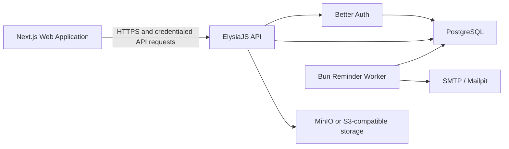

# TransitOps

TransitOps is a full-stack transport operations platform for managing vehicles, drivers, trips,
maintenance, fuel consumption, operational expenses, documents, notifications, and fleet
analytics from a centralized role-aware interface.

The project addresses a common logistics problem: operational data is often distributed across
spreadsheets, paper logs, messaging applications, and independent accounting records. TransitOps
brings those workflows into one system and enforces the business rules that prevent double
assignment, unsafe dispatch, capacity violations, and incorrect vehicle availability.

## Project Overview

TransitOps provides an end-to-end workflow for a transport organization:

- Register and manage fleet assets.
- Maintain driver profiles, license validity, safety data, and operational status.
- Create, dispatch, start, complete, and cancel trips.
- Prevent unavailable vehicles and drivers from being assigned.
- Move vehicles into and out of maintenance with automatic status updates.
- Record fuel purchases and other operational expenses.
- Upload and retrieve vehicle documents through S3-compatible object storage.
- Calculate fleet KPIs, operational cost, fuel efficiency, monthly revenue, and vehicle ROI.
- Export operational information as CSV and analytics summaries as PDF.
- Notify users about operational events and driver-license expiry.
- Restrict application access through authentication, account approval, and RBAC.

## Architecture



The frontend and backend are independently deployable. PostgreSQL is the system of record,
object storage holds vehicle documents, and the worker performs license-reminder delivery. The
local Docker Compose configuration provides PostgreSQL, MinIO, and Mailpit without requiring any
Backend-as-a-Service.

## Technology Stack

### Frontend

| Technology                   | Purpose                                                   |
| ---------------------------- | --------------------------------------------------------- |
| Next.js 14                   | Application routing, rendering, and production build      |
| React 18                     | Component-based user interface                            |
| TypeScript                   | Static type safety                                        |
| TanStack Query               | Server-state fetching, caching, and mutation invalidation |
| TanStack Table               | Structured tabular data support                           |
| React Hook Form and Zod      | Form handling and validation support                      |
| Recharts                     | Analytics and monthly-revenue visualization               |
| Tailwind CSS and project CSS | Responsive styling and theme implementation               |
| Vitest and Testing Library   | Unit and component testing                                |
| Playwright                   | Browser-level workflow testing                            |
| Prettier and ESLint          | Formatting and source-quality enforcement                 |

### Backend

| Technology                  | Purpose                                                       |
| --------------------------- | ------------------------------------------------------------- |
| Bun                         | Runtime, package manager, test runner, and build tool         |
| ElysiaJS                    | Typed HTTP API and route composition                          |
| TypeScript                  | Strict backend typing                                         |
| PostgreSQL 17               | Relational system of record                                   |
| Drizzle ORM and Drizzle Kit | Schema definitions, queries, and migrations                   |
| Better Auth                 | Email/password authentication and PostgreSQL sessions         |
| Amazon S3 SDK               | S3-compatible document upload, deletion, and signed downloads |
| MinIO                       | Self-hosted S3-compatible storage for local development       |
| Nodemailer                  | SMTP email delivery                                           |
| Mailpit                     | Local SMTP capture and email inspection                       |
| PDF-Lib                     | Server-side PDF export                                        |
| Pino                        | Structured application logging                                |
| Zod                         | Environment validation                                        |
| OpenAPI plugin              | Interactive API documentation                                 |

## User Roles and Responsibilities

TransitOps includes five operational roles.

| Role              | Primary responsibility                                                                                         |
| ----------------- | -------------------------------------------------------------------------------------------------------------- |
| Fleet Manager     | Fleet lifecycle, maintenance, vehicle documents, organization settings, user approval, roles, and audit review |
| Dispatcher        | Draft creation, vehicle/driver assignment, dispatch, trip monitoring, completion, and cancellation             |
| Driver            | Access to the linked driver profile and assigned trips; permitted trip lifecycle actions                       |
| Safety Officer    | Driver compliance, license validity, status, suspension, and reminder actions                                  |
| Financial Analyst | Fuel logs, expenses, exports, operational cost, and analytics                                                  |

Permissions are stored in PostgreSQL through roles, permissions, role-permission mappings, and
user-role assignments. The backend is authoritative: hiding navigation items in the frontend does
not replace server-side authorization.

## Authentication and Account Approval

Authentication is implemented with Better Auth using email/password credentials and database-backed
sessions.

The current account flow is:

1. A user opens `/signup` and provides a name, email, password, and organization code.
2. `POST /api/v1/registration` validates the organization code against its stored password hash.
3. The account is created as `PENDING`, inactive, and without an operational role.
4. A Fleet Manager reviews pending requests in the Settings page.
5. The Fleet Manager approves or rejects the account.
6. Approval assigns exactly one role and activates the account.
7. A Driver account must be linked to an unassigned driver profile.
8. Pending, rejected, suspended, and inactive accounts cannot obtain application access.

The Settings user-administration interface also allows a Fleet Manager to change roles, suspend or
reactivate users, inspect the database permission matrix, and rotate the organization signup code.

Sessions are stored in PostgreSQL and transmitted through HTTP-only cookies. Production mode enables
secure cookies. CORS is restricted to the configured frontend origin and allows credentialed requests.

## Core Business Rules

Business rules are enforced by the backend rather than relying on UI validation.

### Vehicle rules

- Registration numbers are unique within an organization, case-insensitively.
- Vehicle status is one of `AVAILABLE`, `ON_TRIP`, `IN_SHOP`, or `RETIRED`.
- `IN_SHOP`, `RETIRED`, and `ON_TRIP` vehicles are excluded from dispatch availability.
- Vehicle load capacity, odometer, and acquisition cost cannot be negative.
- A retired vehicle remains retired when related workflows release resources.

### Driver rules

- License numbers are unique within an organization, case-insensitively.
- Driver status is one of `AVAILABLE`, `ON_TRIP`, `OFF_DUTY`, or `SUSPENDED`.
- Suspended, unavailable, and expired-license drivers cannot be assigned.
- A driver profile can be linked to at most one user account.
- Safety score and completion rate remain between zero and one hundred.

### Trip rules

- A trip begins as a draft.
- Dispatch requires an available vehicle, an available eligible driver, and a valid assignment.
- Cargo weight cannot exceed the selected vehicle's maximum load capacity.
- A vehicle or driver already used by an active trip cannot be assigned again.
- Dispatch atomically changes both the vehicle and driver to `ON_TRIP`.
- Completion records final odometer and fuel consumption, then restores both resources to
  `AVAILABLE`.
- A final odometer cannot be lower than the vehicle's current odometer.
- Cancelling a dispatched or active trip releases the assigned resources.
- Trip lifecycle changes are recorded as append-only trip events.
- PostgreSQL transactions and row locks protect dispatch and lifecycle updates from concurrent
  double assignment.

### Maintenance rules

- Only eligible vehicles can enter maintenance.
- A vehicle can have only one active maintenance record.
- Opening maintenance moves the vehicle to `IN_SHOP` and removes it from dispatch selection.
- Closing or cancelling maintenance restores the vehicle to `AVAILABLE`, unless it is retired.

## Main Workflows

### Dispatch workflow

1. The Dispatcher creates a draft with source, destination, cargo, distance, vehicle, and driver.
2. The backend locks the trip and assigned resources.
3. It validates lifecycle state, availability, license expiry, capacity, and active assignments.
4. The trip becomes `DISPATCHED`; the vehicle and driver become `ON_TRIP`.
5. The trip may be started and becomes `IN_PROGRESS`.
6. Completion records final operational values and restores resource availability.
7. Every lifecycle action creates a trip-event record.

### Maintenance workflow

1. A Fleet Manager creates an active maintenance record.
2. The selected vehicle becomes `IN_SHOP` within the same transaction.
3. Dispatch queries no longer return that vehicle.
4. Closing or cancelling maintenance restores its correct lifecycle status.

### License reminder workflow

1. The Bun worker reads each organization's configured reminder window.
2. It selects linked drivers whose licenses expire within that window.
3. A delivery row with a daily deduplication key is created.
4. The worker sends an SMTP email and records success or failure metadata.
5. Local messages are inspectable through Mailpit.

The current worker is a one-shot process. A deployment scheduler or cron service must invoke
`bun run worker` at the desired interval. The application does not require a hosted scheduler
provider.

## Application Screens

| Route              | Purpose                                                               |
| ------------------ | --------------------------------------------------------------------- |
| `/login`           | Email/password authentication and demo credential shortcuts           |
| `/signup`          | Account request and organization-code entry                           |
| `/signup/pending`  | Pending approval explanation                                          |
| `/dashboard`       | Operational KPIs, recent trips, filters, and status distribution      |
| `/fleet`           | Vehicle registry, filters, creation, editing, retirement, and details |
| `/fleet/:id`       | Vehicle detail and document context                                   |
| `/drivers`         | Driver registry, compliance information, status, and management       |
| `/drivers/:id`     | Driver detail                                                         |
| `/trips`           | Draft creation, dispatch board, and trip lifecycle operations         |
| `/trips/:id`       | Trip detail and events                                                |
| `/driver/my-trips` | Driver-owned trip assignments                                         |
| `/maintenance`     | Maintenance log creation, closure, cancellation, and service history  |
| `/fuel-expenses`   | Fuel records, other expenses, totals, and exports                     |
| `/analytics`       | KPIs, seven-month revenue chart, and costliest vehicles               |
| `/settings`        | Organization settings, user approval, roles, and permission matrix    |

## Backend API

All application APIs use the `/api/v1` prefix.

| Route group                                 | Responsibilities                                                |
| ------------------------------------------- | --------------------------------------------------------------- |
| `/api/v1/auth/*`                            | Better Auth sign-in, sign-out, session, and password operations |
| `/api/v1/registration`                      | Public account request with pending approval                    |
| `/api/v1/me`                                | Authenticated identity, roles, permissions, and linked driver   |
| `/api/v1/dashboard/*`                       | KPI, recent-trip, and vehicle-status data                       |
| `/api/v1/vehicles`                          | Vehicle list and creation                                       |
| `/api/v1/vehicles/:id`                      | Vehicle detail and update                                       |
| `/api/v1/vehicles/available`                | Dispatch-eligible vehicles                                      |
| `/api/v1/vehicles/:id/retire`               | Vehicle retirement command                                      |
| `/api/v1/drivers`                           | Driver list and creation                                        |
| `/api/v1/drivers/:id`                       | Driver detail and update                                        |
| `/api/v1/drivers/eligible`                  | Dispatch-eligible drivers                                       |
| `/api/v1/drivers/me`                        | Linked driver's own profile                                     |
| `/api/v1/drivers/:id/status`                | Driver status update                                            |
| `/api/v1/drivers/:id/suspend`               | Safety suspension command                                       |
| `/api/v1/drivers/:id/send-license-reminder` | Manual reminder action                                          |
| `/api/v1/trips`                             | Trip list and draft creation                                    |
| `/api/v1/trips/:id`                         | Trip detail and draft update                                    |
| `/api/v1/trips/:id/events`                  | Trip lifecycle history                                          |
| `/api/v1/trips/my-assignments`              | Driver-owned assignments                                        |
| `/api/v1/trips/:id/dispatch`                | Atomic dispatch command                                         |
| `/api/v1/trips/:id/start`                   | Start command                                                   |
| `/api/v1/trips/:id/complete`                | Completion command                                              |
| `/api/v1/trips/:id/cancel`                  | Cancellation command                                            |
| `/api/v1/maintenance`                       | Maintenance list and opening command                            |
| `/api/v1/maintenance/:id`                   | Maintenance detail                                              |
| `/api/v1/maintenance/:id/close`             | Close command                                                   |
| `/api/v1/maintenance/:id/cancel`            | Cancellation command                                            |
| `/api/v1/fuel-logs`                         | Fuel-log CRUD                                                   |
| `/api/v1/expenses`                          | Expense CRUD                                                    |
| `/api/v1/analytics/*`                       | Summary, monthly revenue, and vehicle-cost analysis             |
| `/api/v1/exports/:resource.csv`             | Authorized CSV exports                                          |
| `/api/v1/exports/analytics.pdf`             | Analytics PDF export                                            |
| `/api/v1/vehicles/:id/documents`            | Vehicle document list and upload                                |
| `/api/v1/vehicle-documents/:id/download`    | Five-minute signed download URL                                 |
| `/api/v1/vehicle-documents/:id`             | Document deletion                                               |
| `/api/v1/notifications`                     | In-app notification list                                        |
| `/api/v1/notifications/:id/read`            | Mark notification as read                                       |
| `/api/v1/settings/organization`             | Organization preferences                                        |
| `/api/v1/settings/users`                    | Fleet Manager user administration                               |
| `/api/v1/settings/permissions`              | Database-backed RBAC matrix                                     |
| `/api/v1/audit`                             | Organization audit history                                      |
| `/api/v1/health/live`                       | Process liveness                                                |
| `/api/v1/health/ready`                      | Database readiness                                              |
| `/api/v1/docs`                              | Interactive OpenAPI documentation                               |

Successful application endpoints generally use:

```json
{
  "data": {}
}
```

Application errors use a consistent envelope:

```json
{
  "error": {
    "code": "ERROR_CODE",
    "message": "Human-readable description",
    "requestId": "request-correlation-id"
  }
}
```

## Database Model

The Drizzle schema is separated by domain and includes:

- `organizations`
- `users`, `sessions`, `accounts`, and `verifications`
- `roles`, `permissions`, `role_permissions`, and `user_roles`
- `vehicles`
- `drivers`
- `trips` and `trip_events`
- `maintenance_records`
- `fuel_logs`
- `expenses`
- `vehicle_documents`
- `notifications`
- `email_deliveries`
- `audit_events`

Tables use UUID or Better Auth-compatible identifiers, foreign keys, organization indexes,
case-insensitive uniqueness where required, numeric constraints, lifecycle indexes, and optimistic
version columns for concurrency-sensitive entities.

## Vehicle Document Storage

Vehicle files are stored outside PostgreSQL. The database stores metadata and the S3 object key.

Current upload policy:

- Accepted formats: PDF, PNG, and JPEG.
- Default maximum size: 10 MB, controlled by `MAX_UPLOAD_BYTES`.
- Upload is restricted to Fleet Managers.
- Object keys include the organization and vehicle identifiers.
- Downloads use an authorized pre-signed URL valid for five minutes.
- Local development uses MinIO through the same AWS S3 SDK used by the backend.

MinIO does not need to be used in production when an S3-compatible managed bucket is available.
Production storage credentials must be supplied through environment variables and must never be
committed.

## Local Development

### Prerequisites

- Bun 1.2 or newer
- Docker Desktop with Docker Compose
- Git
- A modern browser

### 1. Clone the repository

```bash
git clone <repository-url>
cd Transits_Ops
```

### 2. Start local infrastructure

```bash
cd backend
docker compose up -d postgres minio minio-init mailpit
```

Local service endpoints:

| Service        | Address                 |
| -------------- | ----------------------- |
| PostgreSQL     | `127.0.0.1:55432`       |
| MinIO API      | `http://127.0.0.1:9000` |
| MinIO console  | `http://127.0.0.1:9001` |
| Mailpit SMTP   | `127.0.0.1:1025`        |
| Mailpit web UI | `http://127.0.0.1:8025` |

### 3. Configure the backend

```powershell
Copy-Item .env.example .env
```

Generate a private Better Auth secret of at least 32 characters and replace the example value.
Review all credentials before starting a shared or production environment.

### 4. Install dependencies and migrate

```bash
bun install
bun run db:migrate
```

The backend package declares `bun run db:seed`, but the current repository does not include
`backend/src/db/seed.ts`. A clean environment therefore requires the project seed/bootstrap file or
an existing populated PostgreSQL database before demo accounts can authenticate. This should be
resolved before submission or clean-room deployment.

### 5. Start the backend

```bash
bun run dev
```

The API is available at `http://localhost:4000` and OpenAPI documentation at
`http://localhost:4000/api/v1/docs`.

### 6. Configure and start the frontend

Open a second terminal:

```bash
cd Frontend
bun install
```

Create `.env.local`:

```env
NEXT_PUBLIC_API_URL=http://localhost:4000
```

Start the application:

```bash
bun run dev
```

Open `http://localhost:3000`.

### 7. Run the reminder worker

```bash
cd backend
bun run worker
```

For repeated execution, configure the deployment platform to run this command daily.

## Environment Variables

### Backend

| Variable                       | Purpose                                                          |
| ------------------------------ | ---------------------------------------------------------------- |
| `NODE_ENV`                     | `development`, `test`, or `production` behavior                  |
| `HOST`                         | API bind address                                                 |
| `PORT`                         | API port                                                         |
| `FRONTEND_ORIGIN`              | Exact allowed browser origin for credentialed CORS               |
| `DATABASE_URL`                 | PostgreSQL connection string                                     |
| `BETTER_AUTH_SECRET`           | Session and authentication signing secret, minimum 32 characters |
| `BETTER_AUTH_URL`              | Public backend authentication base URL                           |
| `DEFAULT_ORGANIZATION_SLUG`    | Organization selected by public registration                     |
| `SEED_ORGANIZATION_CODE`       | Development organization code used by the seed/bootstrap process |
| `REGISTRATION_INTERNAL_SECRET` | Internal guard between registration and Better Auth signup       |
| `S3_ENDPOINT`                  | MinIO or S3-compatible endpoint                                  |
| `S3_REGION`                    | Storage region                                                   |
| `S3_BUCKET`                    | Vehicle-document bucket                                          |
| `S3_ACCESS_KEY`                | Storage access key                                               |
| `S3_SECRET_KEY`                | Storage secret key                                               |
| `SMTP_HOST`                    | SMTP server hostname                                             |
| `SMTP_PORT`                    | SMTP server port                                                 |
| `SMTP_FROM`                    | Sender identity for reminder emails                              |
| `REMINDER_CRON`                | Intended reminder schedule configuration                         |
| `MAX_UPLOAD_BYTES`             | Maximum accepted document size                                   |
| `LOG_LEVEL`                    | Structured logging level                                         |

### Frontend

| Variable              | Purpose                                    |
| --------------------- | ------------------------------------------ |
| `NEXT_PUBLIC_API_URL` | Browser-accessible TransitOps API base URL |

Never commit `.env` or `.env.local`. Production values should be managed by the deployment
platform's secret manager.

## Demo Accounts

The login page contains shortcuts for the following database accounts:

| Display name      | Email                       | Role              |
| ----------------- | --------------------------- | ----------------- |
| Raven K.          | `raven.k@transitops.in`     | Dispatcher        |
| Fleet Manager     | `fleet@transitops.in`       | Fleet Manager     |
| Alex              | `driver.alex@transitops.in` | Driver            |
| Safety Officer    | `safety@transitops.in`      | Safety Officer    |
| Financial Analyst | `finance@transitops.in`     | Financial Analyst |

Development password:

```text
Transit@2026
```

The buttons only prefill credentials. Authentication still occurs against Better Auth and
PostgreSQL. The accounts must exist in the connected database.

## Development Commands

### Backend

```bash
bun run dev
bun run worker
bun run build
bun run start
bun run typecheck
bun run lint
bun run test
bun run test:integration
bun run db:generate
bun run db:migrate
bun run db:seed
bun run db:studio
bun run format
bun run format:check
bun run check
```

### Frontend

```bash
bun run dev
bun run build
bun run start
bun run lint
bun run typecheck
bun run test
bun run test:e2e
bun run format
bun run format:check
bun run check
```

Browser tests expect the required backend and infrastructure to be available.

## Production Deployment

Deploy the system as separate components:

1. PostgreSQL database.
2. Backend API service.
3. Next.js frontend service.
4. S3-compatible object storage.
5. Scheduled worker invocation.
6. SMTP provider.

Recommended deployment sequence:

1. Back up PostgreSQL.
2. Configure backend secrets and connectivity.
3. Run `bun run db:migrate` as a one-time release task.
4. Start the backend and verify `/api/v1/health/live` and `/api/v1/health/ready`.
5. Deploy the frontend with the public API URL.
6. Configure the worker as a daily scheduled job.
7. Verify document upload, signed download, and SMTP delivery.
8. Complete role-based smoke tests.

Production requirements:

- Use HTTPS for frontend and backend.
- Use a high-entropy Better Auth secret.
- Set the exact production frontend origin.
- Use restricted database, storage, and SMTP credentials.
- Do not expose PostgreSQL or the MinIO console publicly.
- Apply bucket lifecycle, backup, and retention policies.
- Rotate the development organization code and demo passwords.
- Run only one migration task per release.
- Operate the worker separately from the continuously running API process.

## Security Design

- Passwords are managed by Better Auth rather than application code.
- Sessions use HTTP-only cookies and secure cookies in production.
- Protected endpoints resolve the authenticated actor from the database.
- RBAC is enforced on the backend for each protected operation.
- Every operational query includes organization scope.
- Driver-owned resources are linked through the authenticated user's driver profile.
- Account approval prevents newly registered users from receiving immediate access.
- Request IDs support error correlation.
- Security headers disable MIME sniffing and framing and use a restrictive referrer policy.
- Unique constraints and transactional row locks protect critical invariants.
- Documents are served through short-lived signed URLs rather than public bucket access.

## Evaluator Walkthrough

For a focused demonstration:

1. Sign in as Fleet Manager and show the vehicle registry, maintenance workflow, user approval, and
   permission matrix.
2. Sign in as Dispatcher and create a trip using Van-05 and Alex.
3. Attempt to exceed the vehicle's capacity and show the server-side rejection.
4. Dispatch a valid trip and show the automatic vehicle and driver status changes.
5. Start and complete the trip with final odometer and fuel consumption.
6. Confirm that the assigned vehicle and driver become available again.
7. Open maintenance for a vehicle and confirm it disappears from dispatch selection.
8. Sign in as Financial Analyst and record fuel and expense entries.
9. Open Analytics and show KPIs, monthly revenue, and costliest vehicles.
10. Export CSV and PDF reports.
11. Upload a vehicle document and demonstrate the authorized signed download.
12. Run the reminder worker and inspect the captured message in Mailpit.
13. Show OpenAPI documentation and the health endpoints.

This sequence demonstrates the platform's most important evaluation criteria: full-stack
integration, authentication, role authorization, transactional business rules, operational
automation, analytics, exports, document storage, and a deployable self-hosted architecture.

## Repository Structure

```text
Transits_Ops/
  backend/
    drizzle/                  PostgreSQL migrations
    src/
      config/                 Environment validation
      db/                     Database client and domain schemas
      modules/                API modules by business domain
      shared/                 Authentication context, errors, storage, logging, calculations
      app.ts                  Composed Elysia application
      auth.ts                 Better Auth configuration
      server.ts               HTTP process entrypoint
      worker.ts               License-reminder worker
    docker-compose.yml        Local PostgreSQL, MinIO, Mailpit, API, and worker services
    Dockerfile                Backend production image
  Frontend/
    src/
      app/                    Next.js routes and application shell
      components/             Shared providers and layout
      features/               Domain-oriented frontend features
      lib/                    API, authentication, types, and display helpers
    tests/                    Unit and Playwright tests
```

## Current Implementation Note

The application architecture, migrations, route modules, frontend integration, and infrastructure
configuration are present in the repository. Before a clean-room evaluation, restore or add the
missing committed `backend/src/db/seed.ts` referenced by the backend package scripts. Without that
file, migrations can create the schema, but the five demo accounts and sample operational dataset
are not automatically inserted into a fresh PostgreSQL database.

## License

No license file is currently included. Add an explicit license before public distribution.
